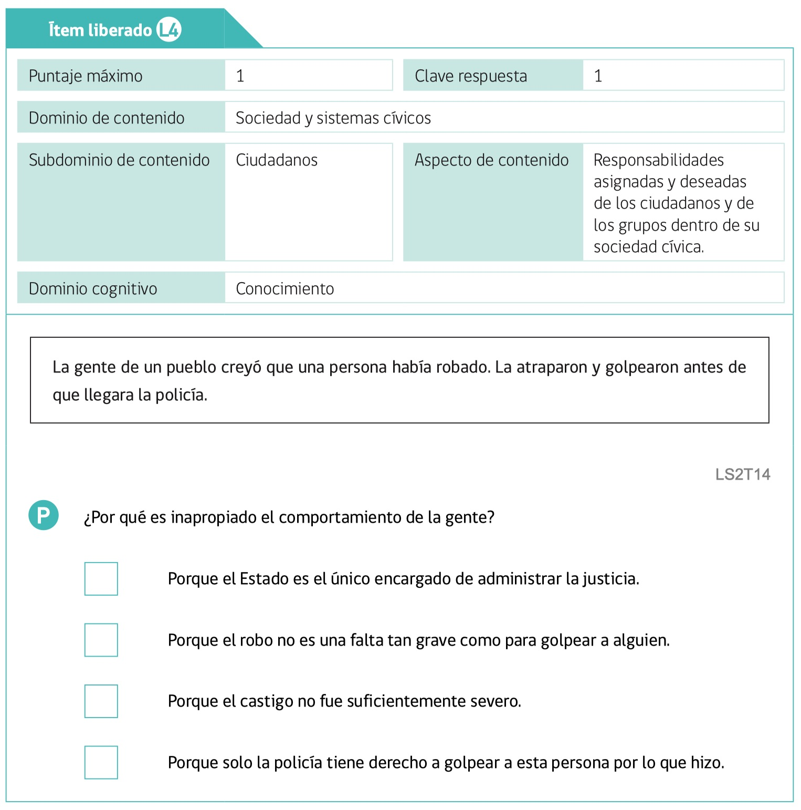
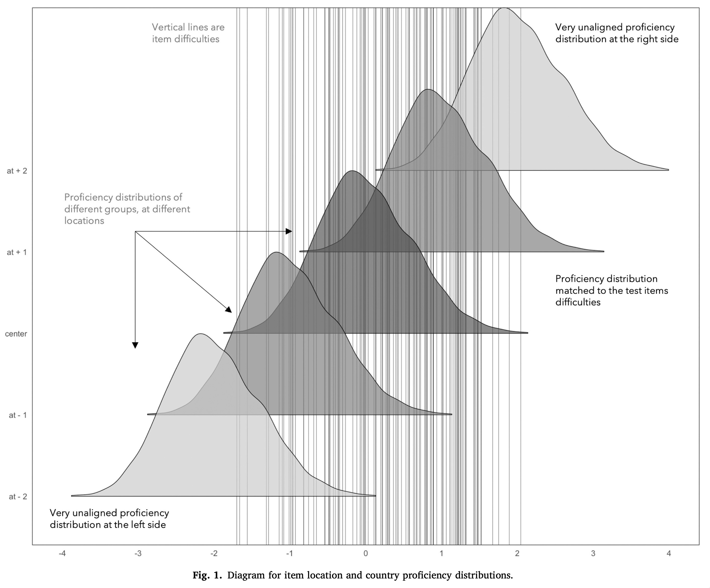
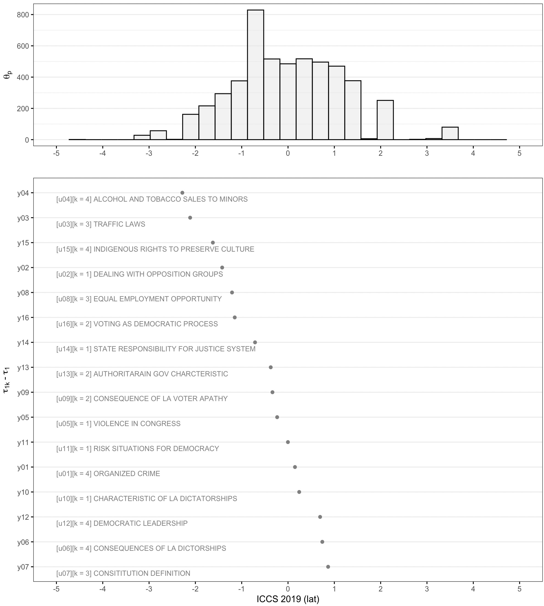
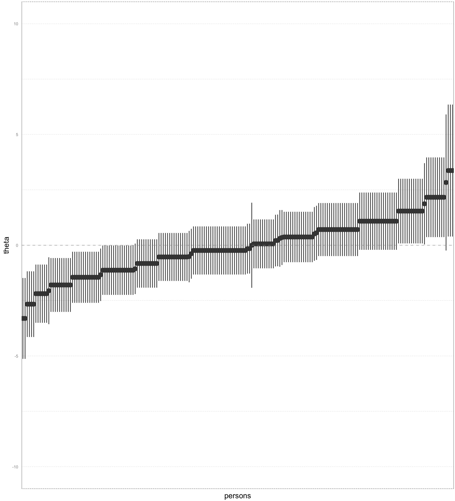
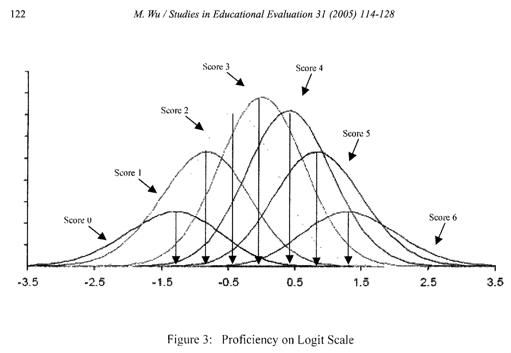
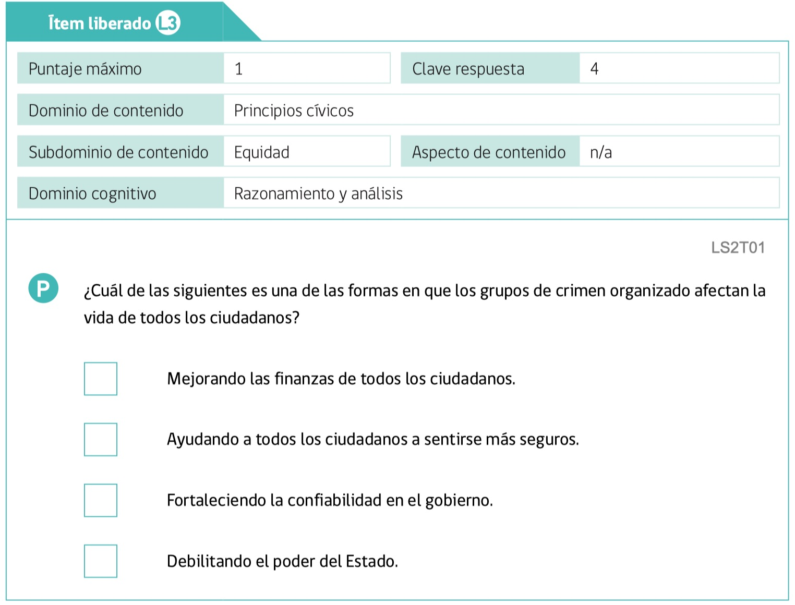
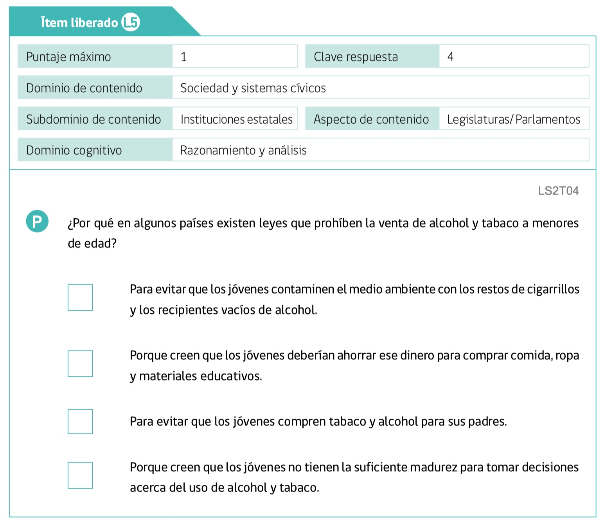
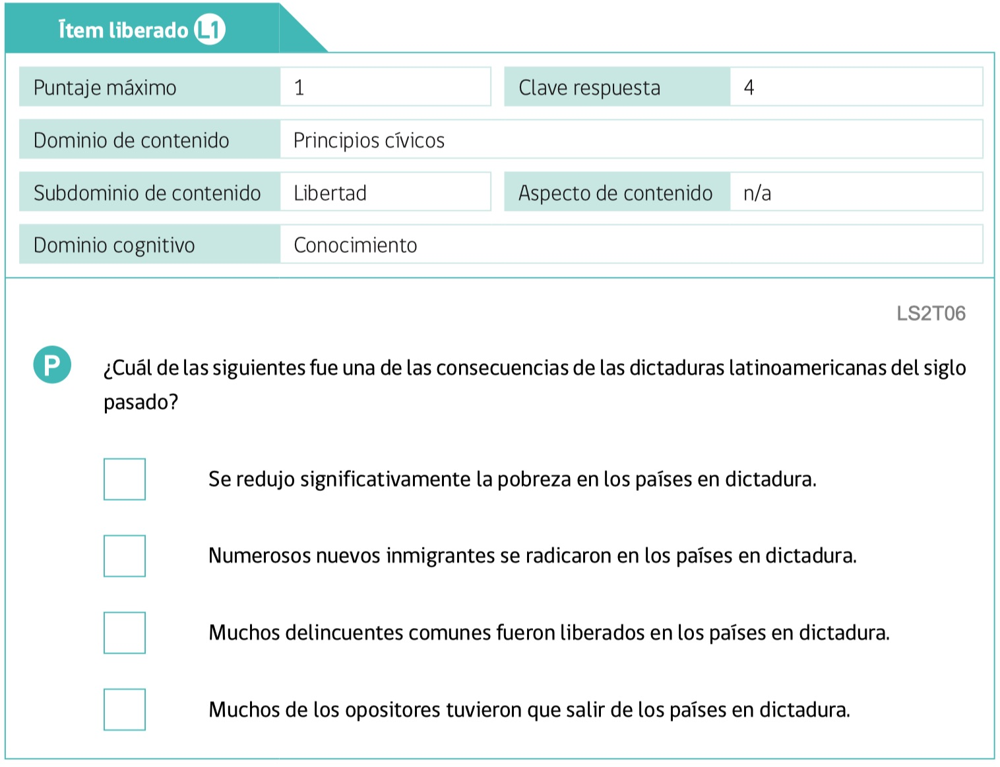
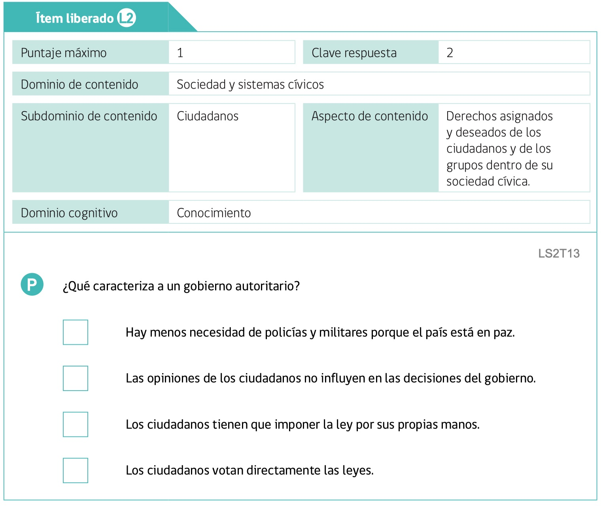




```{r, echo = FALSE, eval = TRUE, include = FALSE}

#---------------------------------------------------------------
# settings
#---------------------------------------------------------------

# start time
start_time <- Sys.time()

# hide messages from dplyr
suppressPackageStartupMessages(library(dplyr))

# hide NA from knitr table
options(knitr.kable.NA = '')

# suppress dplyr group warnings
options(dplyr.summarise.inform = FALSE)

# center figures
knitr::opts_chunk$set(echo = TRUE, fig.align="center")

#---------------------------------------------------------------
# load example data
#---------------------------------------------------------------

# load('rasch_example.RData')

```     

# Introducción

- Vamos a emplear los ítems del módulo latinoamericano de ICCS 2009, o también llamado *test regional de conocimiento cívico*. Este instrumento incluye 16 preguntas de selección múltiple. Estas preguntas fueron diseñadas para evaluar el mismo constructo que el test general, y fueron "calibradas" en un mismo que el test general, de modo que se pueden comparar a las dificultades de este test corto, con el test general (Schulz et al., 2011, p153).

- De este test, contamos con 5 items liberados (ver Agencia de Calidad, 2015). Con estos items liberados podemos hacernos una idea del tipo de preguntas que respondieron los estudiantes de octavo grado.

- Vamos a emplear los datos de Chile de ICCS 2009, para ilustrar como preparar los datos, y como ajustar modelos IRT Rasch, y hacer interpretación de resultados.

# Modelo Rasch

- Una forma de expresar al modelo Rasch es por medio de la siguiente ecuación:

$$ln[Pr(y_{ip} = 1)] = \theta_{p} - \delta_{i}$$

- En términos genéricos este modelo lo podemos interpretar de la siguiente forma: las respuestas correctas ( $y_{ip} = 1$ ) a cada ítem $_{i}$ de cada persona $_{p}$ sobre un instrumento, son condicionales a la habilidad ($\theta$) de las personas $_{p}$ y la dificultad ($\delta$) de cada item $_{i}$.

- Esta es una forma particular de especificar al modelo Rash, para obtener resultados mediante *Marginal Maximum Likelihood* (MML, ver nota).

- Los modelos Rasch pueden ser considerados un caso especial de un modelo mixto (i.e., modelo multinivel), donde las personas son el nivel 2, y las respuestas son el nivel 1. Las dificultades son efectos fijos de los ítems respecto a las respuestas, y las respuestas anidadas en personas producen un efecto aleatorio (i.e., una media latente).

- En términos de ecuaciones estructurales, los modelos Rasch son modelos de variables latentes, de un solo factor que condiciona a respuestas dicotómicas, y con pendiente fija (o factor loading constreñido a uno).

- En términos generales, se puede considerar que el modelo Rasch es muy similar a un modelo ANOVA (*analysis of variance*), en que se divide la varianza entre las personas y al interior de las personas (atribuible a los ítems). Con la salvedad de que la variable de respuesta no es continua, sino dicotómica.

- Existen diferentes formas de obtener los términos de interés de este modelo. En este ejemplo vamos a emplear una librería capaz de estimar modelos mixtos de tipo generalizado (i.e., que puede ajustar regresiones logísticas con efecto aleatorio) llamada `PLmixed`, y además vamos a emplear a la librería `TAM`, la cual estima modelos Rasch de forma canónica. Es decir, de la forma traduciional. La primera librería la vamos a emplear para ilustrar que los modelos Rasch, estimados con MML, son casos especiales de un modelo mixto generalizado. La segunda libería la usaremos para ilustrar el uso de TAM.


::: {.callout-note title="Nota"}

Existen al menos tres formas de producir resultados de modelos Rasch: Conditional Maximum Likelihood (CML), Joint Maximum Likelihood (JML), y Marginal Maximum Likelihood (MML) (Wind et al., 2022). El modelo original de Rasch carece de supuestos distribucionales para los términos $\delta_{i}$ y $\theta_{p}$. Y de esta forma, CML, JML y MML son diferentes formas de estimar (i.e., producir) resultados de los términos de interés del modelo. CML, por ejemplo, reemplaza a $\theta_{p}$ por el estadístico suficiente del modelo: el puntaje total (i.e., la suma de respuestas). JML por su parte, incluye a las personas como efecto fijo y por tanto $\theta_{p}$ carece de varianza. Finalmente, MML incluye a $\theta_{p}$ como efecto aleatorio, y por tanto le brinda una media cero, e incluye una varianza libre. Además, estos diferentes modelos pueden ser reparametrizados, por lo que en vez de centrar a las personas ( $\theta_{p}$ ) con media cero, se constriñen los delta a que sumen cero (Wu et al., 2016). Los diferentes software que ajustan modelos Rasch emplean algunas de estas formas de estimación, e incluyen *defaults* respecto a como parametrizar el modelo ajustado.

:::


# Flujo de trabajo

- En el curso he enfatizado una secuencia de trabajo que nos puede servir. Esta forma de trabajo, supone un flujo de trabajo que posee ciertos pasos, los cuales, por lo general, forman parte de la generación de resultados con un propósito.

- Estos pasos son:
  + *Abrir* los datos
  + *Preparar* los datos
  + *Calcular* cifras
  + *Formatear* resultados
  + *Mostrar* resultados

- En el presente documento, como estamos interesados en la ilustración de los modelos Rasch para items dicotómicos, vamos a quebrar este flujo; pero emplearemos estos diferentes pasos secuenciales para mostrar resultados.

- En la siguiente sección, vamos a ilustrar los pasos llevados a cabo para ajustar un modelo Rasch, sobre los items de conocimiento cívico del Modulo Latinoamericano de ICCS 2009.

## Abrir los datos

- Vamos a abrir los datos que se encuentran en formato *SPSS*. Estos son archvivos de extensión `*.sav`. Vamos a emplear a la libreria `haven`, para que R pueda leer estos datos.

::: {.callout-note title="Nota"}

`library(haven)` puede cargar en sesión de R diferentes formatos de bases de datos incluyendo a datos de SPSS, SAS, y Stata, los cuales son los software estadísticos más comunes con los que se difunden los datos secundarios de varios estudios de gran escala. **ICCS** tradicionalmente es hecho público con datos en formato SPSS, y **PISA** comparte sus datos en formato SPSS y SAS.

:::

```{r , echo=TRUE, warning=FALSE}
#| code-fold: false

#---------------------------------------------------------------
# load data
#---------------------------------------------------------------

# latinoamerican module
data_chl <- haven::read_sav('ISLCHLC2.sav')

# international background questionnaire
data_que <- haven::read_sav('ISGCHLC2.sav')

```


## Preparar los datos

- Vamos a crear una base de datos reducida, la cual contiene los datos que queremos analizar, y unas cuantas variables más (e.g., escolaridad de los padres, SES, dependencia escolar de las escuelas de Chile, entre otras). Sin embargo, el foco central esta en el uso de los items del test de interés, variables `LS2T01`-`LS2T16`.

- Además, vamos a instalar una librería para estudios de gran escala, la cual tiene diferentes *wrapper functions* para operaciones muy comunes en estudios de gran escala. En este caso, vamos a emplear a esta función para operaciones sencillas, como extraer información de los labels de los datos, y crear puntaje *z*.

```{r , echo=TRUE, eval=FALSE, warning=FALSE}
#| code-fold: false

install.packages('devtools')
devtools::install_github('dacarras/ilsa',force = TRUE)

```

::: {.callout-warning title="Advertencia"}

[`library(ilsa)`](https://github.com/dacarras/ilsa) es una librería en desarrollo la cual contiene diferentes funciones comúnmente empleadas para trabajar con datos de gran escala, como la normalización de pesos muestrales, la creación de pesos *jackknife* replicados para ICCS, y otras funciones para extrar información de labels de datos. Es una libreria que incluye a un subconjunto de funciones presentes en [`library(r4sda)`](https://github.com/dacarras/r4sda) solo que esta segunda librería es aun más experimental, y sufre cambios de manera más frecuente que la primera.

:::


- Para analizar a estas variables ( `LS2T01`-`LS2T16` ), necesitamos corregir las respuestas observadas como correctas e incorrectas. En **Anexo 1** se encuentran las frecuencias de respuestas de cada ítem, las cuales indican cual es la respuesta correcta esperada con un `*`. Por ejemplo:

```

> ilsa::variable_label(data_chl$LS2T14)
[1] "STATE RESPONSIBILITY FOR JUSTICE SYSTEM"

> dplyr::count(data_chl, LS2T14, rec_key(LS2T14, key = 1))

  LS2T14                                  `rec_key(LS2T14, key = 1)`     n
  <dbl+lbl>                                                    <dbl> <int>
1  1 [STATE IS THE ONLY ONE IN CHARGE*]                            1  3276
2  2 [STEALING IS NOT AS BAD AS HITTING]                           0   694
3  3 [PUNISHMENT NOT SUFFICIENTLY SEVERE]                          0   522
4  4 [ONLY THE POLICE COULD HIT HIM]                               0   625

```

```{r , echo=TRUE, warning=FALSE}
#| code-fold: true

```

- Luego de que hemos corregido las respuestas observadas, por la clasificación de respuestas correctas e incorrectas, agregamos luego variables que se encuentran en la base de datos del cuestionario internacional, y no son parte del modulo latinoamericano. Recuperamos el indicador de nivel socioeconómico (variable `ses`, indicador original `NISB`), y recuperamos la escolaridad de los padres. Adicionalmente, recolectamos diferentes puntajes de conocimiento cívico que provee el estudio. Entre estos, se encuentran: a) los valores plausibles; b) `NWLCIV` el cual es un puntaje IRT, pero solo los *weighted least estimate* de los 79 ítems internacionales, y c) `KNOWLMLE` es un puntaje IRT (de tipo MLE), que se genera solo con los ítems ancla con el estudio CIVED (versión previa del estudio ICCS 2009, llamado CIVED 1999).

- Con la base de datos generada, que llamamos `data_model`, nos encontramos en condiciones de ajustar modelos IRT sobre los ítems de interés.

```{r , echo=TRUE, warning=FALSE}
#| code-fold: true

#---------------------------------------------------------------
# prep data
#---------------------------------------------------------------

data_cov <- data_que %>%
            mutate(edu = case_when(
            HISCED == 5 ~ 1,
            HISCED == 4 ~ 0,
            HISCED == 3 ~ 0,  
            HISCED == 2 ~ 0,
            HISCED == 1 ~ 0,
            HISCED == 0 ~ 0
            )) %>%
            mutate(ses = ilsa::z_score(NISB)) %>%
            dplyr::select(
            IDCNTRY,   # identficador único del pais
            IDSTUD,    # identficador único del estudiante
            IDSCHOOL,  # identficador único de la escuela
            NWLCIV,    # National civic knowledge scale (international test)
            KNOWLMLE,  # CIVED content knowledge scale (15 linking test)
            PV1CIV,    # Valores plausibles de Civic Knowledge (Prueba internacional)
            PV2CIV,    # Valores plausibles de Civic Knowledge (Prueba internacional)
            PV3CIV,    # Valores plausibles de Civic Knowledge (Prueba internacional)
            PV4CIV,    # Valores plausibles de Civic Knowledge (Prueba internacional)
            PV5CIV,    # Valores plausibles de Civic Knowledge (Prueba internacional)
            ses,       # Indicador de nivel socioeconómico (estandarizado al país)
            edu        # Dummy de educación terciaria de los padres (Universitaria)
            )

#------------------------------------------------
# reference
#------------------------------------------------

# Nota: ver
#
# Brese, F., Jung, M., Mirazchiyski, P., Schulz, W., & Zuehlke, O. (2011). 
# ICCS 2009 User Guide for the International Database, Supplement 3.
# International Association for the Evaluation of Educational Achievement (IEA).

#------------------------------------------------
# data for modelling
#------------------------------------------------

data_model <- data_chl %>%
            mutate(id_p = as.numeric(seq(1:nrow(.)))) %>%
            mutate(sex = case_when(
              SGENDER == 1 ~ 1, # girl
              SGENDER == 0 ~ 0, # boy
              )) %>%
             # Chile: school administration
              mutate(dep = case_when(
                COUNTRY == 'CHL' & IDSTRATE == 1 ~ 1, # Municipal
                COUNTRY == 'CHL' & IDSTRATE == 3 ~ 2, # Subvencionado
                COUNTRY == 'CHL' & IDSTRATE == 2 ~ 3  # Privado
                )) %>%
              mutate(mun = if_else(dep == 1, 1, 0)) %>%
              mutate(sub = if_else(dep == 2, 1, 0)) %>%
              mutate(pri = if_else(dep == 3, 1, 0)) %>%         
            # Latinoamerican test
            mutate(y01 = if_else(LS2T01 == 4, 1, 0)) %>%
            mutate(y02 = if_else(LS2T02 == 1, 1, 0)) %>%
            mutate(y03 = if_else(LS2T03 == 3, 1, 0)) %>%
            mutate(y04 = if_else(LS2T04 == 4, 1, 0)) %>%
            mutate(y05 = if_else(LS2T05 == 1, 1, 0)) %>%
            mutate(y06 = if_else(LS2T06 == 4, 1, 0)) %>%
            mutate(y07 = if_else(LS2T07 == 3, 1, 0)) %>%
            mutate(y08 = if_else(LS2T08 == 3, 1, 0)) %>%
            mutate(y09 = if_else(LS2T09 == 2, 1, 0)) %>%
            mutate(y10 = if_else(LS2T10 == 1, 1, 0)) %>%
            mutate(y11 = if_else(LS2T11 == 1, 1, 0)) %>%
            mutate(y12 = if_else(LS2T12 == 4, 1, 0)) %>%
            mutate(y13 = if_else(LS2T13 == 2, 1, 0)) %>%
            mutate(y14 = if_else(LS2T14 == 1, 1, 0)) %>%
            mutate(y15 = if_else(LS2T15 == 4, 1, 0)) %>%
            mutate(y16 = if_else(LS2T16 == 2, 1, 0)) %>%
            dplyr::select(
            id_p, COUNTRY, IDCNTRY, IDSTUD, IDSCHOOL, 
            TOTWGTS, JKZONES, JKREPS,
            sex, dep, mun, sub, pri, LS2T01:LS2T16, y01:y16) %>%
            mutate(test_sum = ilsa::sum_score(
              y01,y02,y03,y04,
              y05,y06,y07,y08,
              y09,y10,y11,y12,
              y12,y14,y15,y16
              )) %>%
            dplyr::left_join(.,
            data_cov, by = c('IDCNTRY', 'IDSTUD', 'IDSCHOOL')) %>%
            dplyr::glimpse()   


```


# Modelo Rasch como modelo mixto generalizado

- Vamos a recurrir a una forma diferente de parametrización del modelo anterior, el cual debiera ser más intuitiva para que podamos interpretar en que consiste el modelo Rasch. En términos generales, un modelo Rasch es una regresión logistica, en que los ítems condicionan (i.e., predicen) a las respuestas. Pero, con un detalle, que las personas son incluidas como efecto aleatorio en el modo de estimación que hemos elegido (*Marginal Maximum Likelihood*). Es decir, es un modelo mixto o modelo multinivel generalizado, en que empleamos a items como efectos fijos, y a personas como efectos aleatorios. Esta idea se encuentra desarrollada en de Boeck et al. (2011), en la cual se ilustra como ajustar modelos Rasch, empleando a la librería `lme4`.

- En nuestro caso vamos a emplear una librería llamada `library(PLmixed)`, la cual puede ajustar estos modelos, pero posee tiempos de estimación menores.

::: {.callout-warning title="Advertencia"}

Los modelos mixtos generalizados pueden tener tiempos de estimación mayores en contraste a modelos más simples como los modelos de regresión lineal. Este tiempo depende de las librerías disponibles. De esta forma, si quieren reproducir los resultados ilustrados en este documento, el tiempo que se demore en completar todos los pasos puede ser más de lo esperado.

:::

- En el modelo que vamos a ajustar, $y_{ip}$ es una variable dictotómica, y como tal, la podemos condicionar en un modelo de regresión logística.

- $\delta_{i}$ son dificultades, estas expresan la relación entre un ítem, y que las respuestas sobre $y_{ip}$ sean clasificadas como respuestas correctas (valor uno) en incorrecta (valor cero).

- Si emplearamos un modelo mixto, es decir un modelo multinivel, podemos obtener a todos los términos que incluye el modelo Rasch.

- Si tuvieramos a los datos en un formato *apilado* (i.e., *stacked*) (Hoffman, 2015), donde cada fila es una respuesta, y cada 16 filas, tenemos a las respuestas de una misma persona podriamos ajustar el model Rasch como un modelo mixto generalizado.

$$ln[Pr(y_{ip} = 1)] = \delta_{i} + \theta{p}$$

- Vamos a preparar a los datos en este formato para ajustar el modelo descrito en la ecuación anterior, con una regresión logística, en particular con una modelo de regresión logística multinivel.

::: {.callout-note title="Nota"}

No son muchas las referencias que incluyan una nomenclatura para hablar del formato de la base de datos. Excepciones son Hoffman (2015) y Singer & Willet (2003). Estos libros son acerca de modelos longitudinales los cuales tradicionalmente consisten en modelos donde tenemos observaciones repetidas sobre las mismas personas, y donde tradicionalmente se separa la varianza entre las ocasiones, y las personas. En este tipo de estudios es común variar el formato de la base de datos de *apilado* (*stacked*) a *multivariado* (*wide*). El analisis de datos de ítems, bajo el marco general de variables latentes, y de IRT, es común que este procedimiento tambien sea empleado, de modo de emplear rutinas comunes a los analisis multinivel, o rutinas de análisis de ecuaciones estructurales.

:::

## Datos apilados

- Tradicionalmente los datos en estudios de gran escala, se encuentra en formato *multivariado* (i.e. *wide*):

```{r , echo=TRUE, warning=FALSE}
#| code-fold: true

set.seed(20240404)
data.frame(
persons = 1:5,
y1 = sample(0:1, 5, replace = TRUE),
y2 = sample(0:1, 5, replace = TRUE),
y3 = sample(0:1, 5, replace = TRUE),
y4 = sample(0:1, 5, replace = TRUE)
) %>%
knitr::kable()

```

- Sin embargo, para ajustar el modelo que estamos proponiendo necesitamos un formato *apilado* (i.e., *stacked*)

```{r , echo=TRUE, warning=FALSE}
#| code-fold: true

set.seed(20240404)
data.frame(
persons = 1:5,
y1 = sample(0:1, 5, replace = TRUE),
y2 = sample(0:1, 5, replace = TRUE),
y3 = sample(0:1, 5, replace = TRUE),
y4 = sample(0:1, 5, replace = TRUE)
) %>%
tidyr::pivot_longer(
cols = y1:y4,
names_to = 'items',
values_to = 'y'
) %>%
knitr::kable()

```
- Vamos a cambiar el formato original de los datos al formato que estamos proponiendo. Es decir que vamos a trasponer las respuestas que estan a lo ancho, y las vamos a relocalizar a lo largo.

```{r , echo=TRUE, warning=FALSE}
#| code-fold: true

data_stacked <- data_model %>%
dplyr::select(id_p, y01:y16) %>%
tidyr::pivot_longer(
cols = y01:y16,
names_to = 'items',
values_to = 'y'
) %>%
dplyr::glimpse()


```
- Ahora, nuestra base de datos analizable se ve de la siguiente forma, para una seleccion de tres casos, y una muestra de 4 items.

```{r , echo=TRUE, warning=FALSE}
#| code-fold: true

data_stacked %>%
dplyr::filter(id_p %in% c(1,3,4)) %>%
dplyr::slice_sample(n = 4, by = id_p) %>%
knitr::kable()

```
## Ajustar modelo

- Para ajustar el modelo anterior, escribimos el siguiente código:

```{r , echo=TRUE, eval=FALSE, warning=FALSE}
#| code-fold: false

library(PLmixed)
rasch_mlm <- PLmixed(
  # formula que expresa el modelo
  formula = y ~ -1 + items + (1 | id_p),
  # indicar la función de enlace
  family = binomial,
  # indicar los datos que serán empleados
  data = data_stacked
)

```

- Con el código anterior, obtenemos los siguientes resultados.

```{r , echo=TRUE, warning=FALSE}
#| code-fold: true

library(PLmixed)
rasch_mlm <- PLmixed(
  formula = y ~ -1 + items + (1 | id_p),
  family = binomial,
  data = data_stacked
)
summary(rasch_mlm)

```

- Notese que los $\delta_{i}$ de este modelo, es decir, los efectos fijos asociados a los ítems, nos indican la relación entre el ítem, y las respuestas correctas.

- Dicho de otro modo, cuando un ítem tiene un coeficiente positivo, significa que hay una relación positiva con observar respuestas correctas; por el contrario, si el coeficiente es negativo, nos indica que respecto a este ítem, hay una relación negativa con las respuestas correctas.

- Lo anterior implica que las $\delta_{i}$ no están parametrizados como "dificultades", sino como "facilidades". No obstante, estos estimados pueden ser interpretados como estimados de *locación* de los items.

- Items de mayor coeficiente son items más fáciles, e ítems de menor punto estimado son más difícles. Con esta información podemos ordenar las preguntas del test empleado, y tener una noción de como contestan el conjunto de individuos que participó de la prueba.

- Un aspecto no trivial de la forma de escribir el código es la "supresión" del intercepto. Esto lo logramos mediante la inclusión del `-1` antes de incluir a la columna `items`. Por su parte, la variable `items`, como contiene texto, esta siendo interpretada por la librería como un conjunto de factores, y está siendo ingresada al modelo como un conjunto de variables *dummy*, de valor 0 cuando está ausente, y valor uno, cuando en la fila se encuentra registrada la respuesta al ítem respectivo.

- 'formula = y ~ **-1** + items + (1 | id_p)'
  + incluimos a `-1` para remover de la estimación al intercepto.
  + el modelo se encuentra identificado, porque tenemos una media cero y una varianza libre.

- 'formula = y ~ -1 + **items** + (1 | id_p)'
  + **items** esta siendo ingresado al modelo como un conjunto de variables dummy.
  + cuando reparametricemos el modelo, vamos a incluir de forma explícita a los ítems, como variables dummy.

## Reparametrizando a los deltas

- Podemos reparametrizar el modelo anterior si creamos variables dummy, donde cada item toma un valor 0 cuando no se observa al ítem, y un valor -1 cuando la respuesta está indexada al ítem.

- El objetivo de esta reparametrización es ajustar el modelo Rasch como tradicionalmente lo ajustan los software especializados como `TAM`, `Conquest`, y otros software.

- Es decir, queremos convertir el siguiente modelo $ln[Pr(y_{ip} = 1)] = \delta_{i} + \theta{p}$, en otra expresión equivalente, donde los $\delta_{i}$ sean estimados como dificultades. En otras palabras, queremos ajustar al siguiente modelo:


$$ln[Pr(y_{ip} = 1)] = \theta{p} - \delta_{i}$$


```{r , echo=TRUE, warning=FALSE}
#| code-fold: true

data_stacked <- data_model %>%
dplyr::select(id_p, y01:y16) %>%
tidyr::pivot_longer(
cols = y01:y16,
names_to = 'items',
values_to = 'y'
) %>%
mutate(u01 = dplyr::if_else(items == 'y01', -1, 0)) %>%
mutate(u02 = dplyr::if_else(items == 'y02', -1, 0)) %>%
mutate(u03 = dplyr::if_else(items == 'y03', -1, 0)) %>%
mutate(u04 = dplyr::if_else(items == 'y04', -1, 0)) %>%
mutate(u05 = dplyr::if_else(items == 'y05', -1, 0)) %>%
mutate(u06 = dplyr::if_else(items == 'y06', -1, 0)) %>%
mutate(u07 = dplyr::if_else(items == 'y07', -1, 0)) %>%
mutate(u08 = dplyr::if_else(items == 'y08', -1, 0)) %>%
mutate(u09 = dplyr::if_else(items == 'y09', -1, 0)) %>%
mutate(u10 = dplyr::if_else(items == 'y10', -1, 0)) %>%
mutate(u11 = dplyr::if_else(items == 'y11', -1, 0)) %>%
mutate(u12 = dplyr::if_else(items == 'y12', -1, 0)) %>%
mutate(u13 = dplyr::if_else(items == 'y13', -1, 0)) %>%
mutate(u14 = dplyr::if_else(items == 'y14', -1, 0)) %>%
mutate(u15 = dplyr::if_else(items == 'y15', -1, 0)) %>%
mutate(u16 = dplyr::if_else(items == 'y16', -1, 0)) %>%
dplyr::glimpse()

```

- Ahora, nuestra base de datos analizable posee una variable dummy por cada ítem.

```{r , echo=TRUE, warning=FALSE}
#| code-fold: true

data_stacked %>%
dplyr::filter(id_p %in% c(1)) %>%
knitr::kable()

```

- Con estos nuevos datos analizables podemos ajustar el modelo Rasch con su parametrización tradicional

- Ajustamos nuestro código anterior de forma respectiva, ahora incluyendo a cada uno de los ítems como variable dummy:

```{r , echo=TRUE, warning=FALSE}
#| code-fold: false

library(PLmixed)
rasch_rep <- PLmixed(
  formula = y ~ -1 + 
  u01 + u02 + u03 + u04 + u05 +
  u06 + u07 + u08 + u09 + u10 +
  u11 + u12 + u13 + u14 + u15 +
  u16 +
  (1 | id_p),
  family = binomial,
  data = data_stacked
)

```
- Con el código anterior obtenemos los siguientes resultados:

```{r , echo=TRUE, warning=FALSE}
#| code-fold: true

summary(rasch_rep)

```

## Deltas comparados

- Si comparamos los efectos fijos de ambos modelos, se puede ver que los puntos estimados son los inversos del otro.

- En la primera especificación, el modelo produce puntos estimados en "facilidades" para los ítems. Es decir, a mayor coeficiente el ítem es más fácil.

- En la segunda especificación, los coeficientes producidos están en "dificultades" (i.e., mayor valor, ítem es más dificil, más distante del cero de referencia del modelo).

- Los puntos estimados en cada caso son equivalentes.


```{r , echo=TRUE, warning=FALSE}
#| code-fold: true


table_1 <- coef(rasch_mlm) %>%
purrr::pluck('id_p') %>%
dplyr::select(-`(Intercept)`) %>%
unique() %>%
tidyr::pivot_longer(
cols = names(.),
names_to = 'items',
values_to = 'param_1'
)

table_2 <- coef(rasch_rep) %>%
purrr::pluck('id_p') %>%
dplyr::select(u01:u16) %>%
unique() %>%
tidyr::pivot_longer(
cols = u01:u16,
names_to = 'dummy',
values_to = 'param_2'
)

dplyr::bind_cols(table_1,table_2) %>%
mutate(dif = abs(param_1) - abs(param_2)) %>%
knitr::kable(., digits = 2)

```
::: {.callout-note title="Nota"}

`param_1` contiene los estimados de la primera parametrización, donde los ítems son ingresados como dummy, donde cada ítem observado es 1, y cuando la respuesta observada pertenece a los otros ítems, es codificado como cero. `param_2` contiene a las estimaciones del modelo donde los delta son parametrizados como dificultades, donde un ítem observado es -1, y cuando la respuesta observada pertenece a los otros ítems es codificada como cero.

:::

# Modelo Rasch ajustado con libreria especializada

- Los tiempos de estimación con una libreria no especializada pueden ser muy mayores, solo porque el procedimiento que ejecuta los cálculos podría no estar optimizado. A continuación emplearemos a la librería especializada, la librería **TAM**.

- Vamos a ajustar el modelo en 4 pasos

  + Vamos a crear una matriz de respuesta, la cual solo incluye a los ítems.

  + Vamos a separar los datos analizables a una lista de valores que identifica a las personas.

    + Es decir, un vector que contiene un indentificador único de los participantes.

    + Este paso nos servirá para extraer realizaciones de $\theta_{p}$, y luego agregar estas realizaciones (los puntajes IRT) a la base de datos original.

  + Vamos a emplear a la funnción `TAM::tam.mml()` para ajustar un modelo Rasch con MML.

  + Finalmente, vamos a desplegar los resultados obtenidos con la función `summary`.


```{r , echo=TRUE, warning=FALSE}
#| code-fold: false

# -----------------------------------------------
# response data
# -----------------------------------------------

data_resp <- data_model %>%
             dplyr::select(y01:y16)

# -----------------------------------------------
# unique identifier
# -----------------------------------------------

id_p_list <- data_model %>%
             dplyr::select(id_p) %>%
             dplyr::pull()

# -----------------------------------------------
# fit model
# -----------------------------------------------

rasch_tam <- TAM::tam.mml(
             resp = data_resp, 
             pid = id_p_list,
             irtmodel = "1PL", 
             verbose = FALSE
             )

# -----------------------------------------------
# results
# -----------------------------------------------

summary(rasch_tam)

```

## Resultados obtenidos

- Como `TAM` es una librería especializada en modelos IRT de tipo Rasch, no solo nos provee de los resultados del modelo mixto, sino que acompaña a la salida de otros indicadores.

- Un resultado que podemos destacar es el **EAP Reliability**. Este indicador es similar al indicador de intra clase de los modelos multinivel, y nos indica que tan separadas están las medias latentes del modelo. Es decir, que tan distintas son los $\theta_{p}$ que el modelo puede generar. Comúnmente a este tipo de indicador se le llama *person separation reliability* (Verhavert et al, 2018; Adams, 2005).

- Medias latentes más separadas, son considerandos puntajes más precisos (i.e., más confiables), ya que significa que, si ordeno a todas las personas en un ranking, necesito moverme menos posiciones en el ranking para indicar que dos personas del ranking ordenado son distintas por sobre la incertidumbre asociada a $\theta_{p}$.

- Estos indicadores de confiabilidad global los podemos obtener con los siguientes códigos

```{r , echo=TRUE, warning=FALSE}
#| code-fold: true

# get wle estimates
tam_wle  <- TAM::tam.wle(rasch_tam, progress = FALSE)

# get objects
theta_wle  <- tam_wle$theta
theta_se   <- tam_wle$error

# create table
reliability_table <- data.frame(
index = c('WLE', 'EAP'),
value = c(TAM::WLErel(theta_wle,theta_se),
TAM::EAPrel(theta_wle,theta_se))
)

# display table
knitr::kable(reliability_table, digits = 2)

```

- Una omisión de esta salida son los errores estándar de los efectos fijos. Los errores estandar de los $\delta_{i}$ (i.e., deltas) se pueden obtener extrayendo elementos que se encuentran dentro del objeto de resultados que hemos generado con la librería TAM. A continuación, extraemos los puntos estimados de los delta que genera TAM.

```{r , echo=TRUE, warning=FALSE}
#| code-fold: true

rasch_tam %>%
purrr::pluck('xsi') %>%
knitr::kable(., digits = 2)

```

- Si comparamos los deltas generados por TAM, estos son equivalentes a los obtenidos con la libreria `PLmixed`, bajo la misma parametrización.

```{r , echo=TRUE, warning=FALSE}
#| code-fold: true

table_1_plmixed <- coef(rasch_rep) %>%
purrr::pluck('id_p') %>%
dplyr::select(u01:u16) %>%
unique() %>%
tidyr::pivot_longer(
cols = u01:u16,
names_to = 'item',
values_to = 'PLmixed_delta'
)

table_2_tam <- rasch_tam %>%
purrr::pluck('xsi') %>%
dplyr::select(xsi) %>%
rename(tam_delta = xsi)

dplyr::bind_cols(table_1_plmixed,table_2_tam) %>%
mutate(dif = abs(PLmixed_delta) - abs(tam_delta)) %>%
knitr::kable(., digits = 2)

```

- Con esta ilustración podemos defender la idea de que un modelo Rasch es esencialmente una regresión logística, en el que los ítems predicen a las respuestas correctas observadas, donde además hemos incluido un término aleatorio para las personas. Rasch, bajo MML, es un modelo mixto generalizado para variables dicotómicas.


# Interpretación de los resultados

## Interpretación de los delta (*items side*)

- Condicional a cómo haya sido parametrizado el modelo, podemos interpretar a los $\delta_{i}$, como dificultad o como facilidad. En términos abstractos que tan común es que observemos a $Pr(y_{i} = 1)$, condicional a un ítem.

- El significado de $Pr(y_{i} = 1)$ se desprende del contenido del instrumento. Mayor $Pr(y_{i} = 1)$ para un ítem puede ser más conocimiento, mayor acuerdo, más frecuencia, u otra expresión de un atributo de interés.

- En este ejemplo, mayor $Pr(y_{i} = 1)$, es mayor conocimiento cívico, i.e., *mayor habilidad*. Esta última interpretación aplica para instrumentos tipo test donde hay respuestas correctas o incorrectas.

- Sin embargo, si el contenido del instrumento fuera otro, como un intrumento de actitudes, creencias, adhesión a normas, autoreporte de dolor, instrumentos con otro tipo de atributo de interés, los $\delta_{i}$ no tiene sentido que sean interpretados como "dificultades" (i.e, no expresan que un item sea más fácil o más díficil). Por ejemplo, en un modelo de victimización escolar (i.e., **bullying items**), los estimados $\delta_{i}$ los podriamos interpretar como la prorporción relativa con la que los eventos de acoso escolar ocurren. En un instrumento de **vocabulario receptivo**, ítems con deltas de mayor valor permiten identificar a palabras menos reconocidas (i.e., palabras menos frecuentes entre los participantes).


### De logits a proporción de respuesta

- Los resultados de dificultad de cada item, nos pueden servir para obtener la proporción de respuestas correctas esperadas a un nivel de habilidad.

- Empleando a la notación de este documento la ecuación que nos sirve para obtener las respuestas correctas esperadas es:

$$Pr(y_{p} = 1 | \delta_{i}, \theta_{p}) = \frac{exp(\theta_{p} - \delta_{i})}{1 + exp(\theta_{p} - \delta_{i})}$$

- Como la media de $\theta_{p}$ es cero para el total de los participantes, podemos remover a $\theta_{p}$ de la ecuación anterior, y obtener con esta la proporción de respuestas correctas esperadas por el modelo, para la habilidad media.

- Por ejemplo el item `y01` obtiene un logit de 0.15; si este lo sometemos a la formula para convertir logits a proporciones, obtendriamos que el ítem `y01` tiene una proporción de respuestas esperadas por el modelo de 54%. 

- Como fue indicado anteriormente, la media del modelo para $\theta_{p}$ es cero. Luego, podemos  estimar directamente las proporciones de respuestas correctas por ítem usando los logits obtenidos .

- Podemos proceder de forma similar, para las respuestas incorrectas, con la siguiente ecuación:

$$Pr(y_{p} = 0 | \delta_{i}, \theta_{p}) = \frac{1}{1 + exp(\theta_{p} - \delta_{i})}$$

- Ahora bien, si prestamos atención a la cantidad de respuestas correctas *observadas*, veremos que para el ítem `y01` es de 53%. Note que existe una *discrepancia* entre el observado y el modelo. Esto se produce por al menos dos aspectos: omisiones de respuestas, y error de medición. El modelo nos entrega la proporcion de respuesta esperadas, aunque no observaramos respuestas a cada ítem para todas las personas. Por otro lado, mientras mayor sea la varianza no explicada por el modelo (i.e., mayor error), menor es el ajuste entre respuestas esperadas, y respuestas observadas.

```{r , echo=TRUE, warning=FALSE}
#| code-fold: true

table_obs <- data_model %>%
dplyr::select(y01:y16) %>%
summarize(
y01 = mean(y01 == 1, na.rm = TRUE),
y02 = mean(y02 == 1, na.rm = TRUE),
y03 = mean(y03 == 1, na.rm = TRUE),
y04 = mean(y04 == 1, na.rm = TRUE),
y05 = mean(y05 == 1, na.rm = TRUE),
y06 = mean(y06 == 1, na.rm = TRUE),
y07 = mean(y07 == 1, na.rm = TRUE),
y08 = mean(y08 == 1, na.rm = TRUE),
y09 = mean(y09 == 1, na.rm = TRUE),
y10 = mean(y10 == 1, na.rm = TRUE),
y11 = mean(y11 == 1, na.rm = TRUE),
y12 = mean(y12 == 1, na.rm = TRUE),
y13 = mean(y13 == 1, na.rm = TRUE),
y14 = mean(y14 == 1, na.rm = TRUE),
y15 = mean(y15 == 1, na.rm = TRUE),
y16 = mean(y16 == 1, na.rm = TRUE)
) %>%
tidyr::pivot_longer(
cols = y01:y16,
names_to = 'items',
values_to = 'observed'
)

table_exp <- rasch_tam %>%
purrr::pluck('xsi') %>%
dplyr::select(xsi) %>%
rename(tam_delta = xsi) %>%
mutate(expected =  exp(-tam_delta)/(1 + exp(-tam_delta))) %>%
dplyr::select(expected)

dplyr::bind_cols(table_obs,table_exp) %>%
mutate(dif = abs(observed) - abs(expected)) %>%
knitr::kable(., digits = 2)

```
### Ajuste de las respuestas al modelo

- Con los resultados ajustados, podemos juzgar si las respuestas frente a los ítems empleados ajustan poco al modelo. Para obtener indicadores de ajuste de los ítems al modelo podemos emplear la función `TAM::tam.fit()`

```{r , echo=TRUE, warning=FALSE}
#| code-fold: false

# ---------------------------------------- 
# item fit
# ---------------------------------------- 

tam_00_fit <- TAM::tam.fit(rasch_tam)

```

- En la siguiente gráfica, empleamos a los *infit* para evaluar si los ítems se encuentran por sobre valores .75 y 1.33 (Wilson, 2023). Estas son recomendaciones generales de tamaño de efecto de discrepancia, pero no son reglas infranqueables.

```{r , echo=TRUE, warning=FALSE}
#| code-fold: true

# ---------------------------------------- 
# dotplot
# ---------------------------------------- 

infit_data <- dplyr::select(tam_00_fit$itemfit, parameter, Infit)

dotchart(infit_data$Infit, labels = infit_data$parameter,
         cex = 0.6, xlab = "Infit", xlim = c(0,2), 
         main = 'weighted mean square, items residuals')
abline(v=c(.75, 1.33), lty = 3)

```

- Item que se encuentran muy distantes de estos limites pueden ser considerados ítems que discrepan al modelo ajustado, por sobre lo esperado por la curva de información del modelo (i.e. por sobre el inverso de la incertidumbre del modelo).


- Este tipo de indicadores debe interpretarse con cuatela, ya que estan basados en $\chi^2$, y por tanto las pruebas los valores $p$ asociados a estos valores son sensibles al tamaño de la cantidad de observacions empleadas en los análisis. En escenarios de muestras grandes como en el caso de los estudios de gran escala, es muy posible que todos los valores $t$ sean signficativos (i.e. valores $p$ < .05; $p$ < .01; $p$ < .001).


```{r , echo=TRUE, warning=FALSE}
#| code-fold: true

# ---------------------------------------- 
# item fit  tables with misfit responses
# ---------------------------------------- 

# responses with lnfit > 1.33 or Infit <.75 and Infit_t > 2

library(dplyr)
item_fit_infit <- tam_00_fit$itemfit %>%
                  dplyr::filter(
                    abs(Infit_t) >2 & Infit > 1.33 | 
                    abs(Infit_t) >2 & Infit <  .75)

knitr::kable(tam_00_fit$itemfit, digits=2)

```

- Para el caso del test analizado, todos los ítems de la prueba en esta aplicación parecen comportarse de forma adecuada.

### Distribución de dificultades

- Si ordenamos a los ítems en términos de su dificultad, podemos tener una noción de cuales son los items más representativos de alto conocimiento cívico, cuáles de conocimiento medio, y cuáles de menor conocimiento.


```{r , echo=TRUE, warning=FALSE}
#| code-fold: true

item_table <- read.table(text = "
var     item_text
u01     '[u][k = 4] ORGANIZED CRIME                        '
u02     '[u][k = 1] DEALING WITH OPPOSITION GROUPS         '
u03     '[u][k = 3] TRAFFIC LAWS                           '
u04     '[u][k = 4] ALCOHOL AND TOBACCO SALES TO MINORS    '
u05     '[u][k = 1] VIOLENCE IN CONGRESS                   '
u06     '[u][k = 4] CONSEQUENCES OF LA DICTORSHIPS         '
u07     '[u][k = 3] CONSITITUTION DEFINITION               '
u08     '[u][k = 3] EQUAL EMPLOYMENT OPPORTUNITY           '
u09     '[u][k = 2] CONSEQUENCE OF LA VOTER APATHY         '
u10     '[u][k = 1] CHARACTERISTIC OF LA DICTATORSHIPS     '
u11     '[u][k = 1] RISK SITUATIONS FOR DEMOCRACY          '
u12     '[u][k = 4] DEMOCRATIC LEADERSHIP                  '
u13     '[u][k = 2] AUTHORITARAIN GOV CHARCTERISTIC        '
u14     '[u][k = 1] STATE RESPONSIBILITY FOR JUSTICE SYSTEM'
u15     '[u][k = 4] INDIGENOUS RIGHTS TO PRESERVE CULTURE  '
u16     '[u][k = 2] VOTING AS DEMOCRATIC PROCESS           '
", header = TRUE)

coef(rasch_rep) %>%
purrr::pluck('id_p') %>%
dplyr::select(u01:u16) %>%
unique() %>%
tidyr::pivot_longer(
cols = u01:u16,
names_to = 'var',
values_to = 'delta'
) %>%
dplyr::left_join(.,
item_table, by = 'var') %>%
arrange(delta) %>%
knitr::kable(., digits = 2)

```

- Podemos ilustrar lo anterior de forma gráfica con un histograma de las deltas obtenidos con el modelo ajustado, donde los delta fueron parametrizados como "dificultades".

```{r , echo=TRUE, warning=FALSE}
#| code-fold: true

hist(x = table_2$param_2,
ylab = 'frecuencia',
xlab = 'deltas',
main = 'Histograma de dificultades de items'
)
abline(v = 0, col = "red", lty = 1)

```

- Contamos con cerca de 6 items sobre cero, y 10 items bajo cero en la escala de logits. Los modelos ajustados estan paramétrizados de forma tal que el cero de $\theta_{p}$, refiere a la media del efecto aleatorio ( $\theta_{p}$ ). En consecuencia, contamos con más items bajo la media de $\theta_{p}$, que sobre la media de $\theta_{p}$.

- Con esta parametrización podríamos sospechar que, dados los resultados observados esta prueba resulta ser más **informativa** para el bajo conocimiento cívico que para el alto nivel de conocimiento cívico.

- Cuando una prueba carece de ítems en un sector de la distribución de $\theta_{p}$, entonces dificilmente la prueba o instrumento empleado puede caracterizar a este sector de la distribución de la propensión de interés. 

- En términos ideales, una prueba altamente informativa de un atributo de interés de una población de participantes, debiera presentar una suerte de *match* entre la habilidad de evaluada y las locaciones de los items. Esta última idea, la ilustramos con el siguiente diagrama (ver Carrasco et al., 2023).

```{r echo=TRUE, out.width = '80%', fig.retina = 1}
#| code-fold: true



```

- Nótese, que la idea de precisión de puntajes con IRT es una propiedad específica de cada media generada. Es decir, que se puede tener un puntaje total de una prueba que tenga alta confiabilidad y aun así contar con sectores de puntajes en la prueba, donde los errores asociados a las realizaciones puedan ser poco precisos a un propósito particular. Por ejemplo, que en un proceso de certificación o clasificación de logrado y no logrado, el punto de corte empleado tenga poca precisión.


## Interpretación de los theta (*person side*)

- Los términos $\theta_{p}$ son las posiciones de los personas en el continuo que produce el modelo. Estos son los términos que, en los estudios de gran escala, son luego convertidos a escalas de media de 500 puntos, y desviación estandar de 100 puntos, y con los que se producen los valores plausibles.

- Los valores de estos términos no significan nada en sí mismos; sino que poseen un significado e interpretación posibles de acuerdo al modelo especificado, siempre en terminos relativos, y referidos a los contenidos de los ítems empleados. En la especificación que estamos empleando, donde la media de $\theta_{p}$ es cero, empleamos este punto de referencia para la interpretación de resultados.

- Formalmente, $\theta_{p}$ es un variable latente, de distribución normal, y varianza libre.

$$\theta_{p} \sim \text{Normal}(\mu, \sigma^2)$$


- Los $\theta_{p}$ tienen sentido de acuerdo al contenido de los items del instrumento. En este caso, sabemos que $Pr(y_{i} = 1)$, como conjunto, implican mayor y menor conocimiento cívico.

- Una de las propiedades de los modelos Rasch, es que las posiciones relativas de los ítems y de las personas, se encuentran en una misma escala. Y como tal, podemos hacer comparaciones de dónde están las personas con respecto a cómo contesta la totalidad de las observaciones.

- Vamos a generar un diagrama de ítems personas (i.e., *item-person maps*, *WrightMaps*), con el cual será más facil ilustrar la interpretación de resultados. Vamos a emplear a la libreria `library(TAM)`, de modo que podamos ajustar un modelo Rasch de forma tradicional.


### Item-person map

- Los diagramas de items-personas incluyen a un histograma de las realizaciones del término $\theta_{p}$. Se les llama realizaciones, o predicciones porque son un término generado con el modelo, que no pre-existen a la base de datos. Son *representaciones*, en algún sentido, de la variable latente que supone el modelo.

```{r , echo=TRUE, eval=TRUE, warning=FALSE, message = FALSE, error = FALSE, collapse = TRUE}
#| code-fold: true

# -----------------------------------------------
# items
# -----------------------------------------------

item_text <- read.table(text = "
item    item_text
y01     '[u01][k = 4] ORGANIZED CRIME                        '
y02     '[u02][k = 1] DEALING WITH OPPOSITION GROUPS         '
y03     '[u03][k = 3] TRAFFIC LAWS                           '
y04     '[u04][k = 4] ALCOHOL AND TOBACCO SALES TO MINORS    '
y05     '[u05][k = 1] VIOLENCE IN CONGRESS                   '
y06     '[u06][k = 4] CONSEQUENCES OF LA DICTORSHIPS         '
y07     '[u07][k = 3] CONSITITUTION DEFINITION               '
y08     '[u08][k = 3] EQUAL EMPLOYMENT OPPORTUNITY           '
y09     '[u09][k = 2] CONSEQUENCE OF LA VOTER APATHY         '
y10     '[u10][k = 1] CHARACTERISTIC OF LA DICTATORSHIPS     '
y11     '[u11][k = 1] RISK SITUATIONS FOR DEMOCRACY          '
y12     '[u12][k = 4] DEMOCRATIC LEADERSHIP                  '
y13     '[u13][k = 2] AUTHORITARAIN GOV CHARCTERISTIC        '
y14     '[u14][k = 1] STATE RESPONSIBILITY FOR JUSTICE SYSTEM'
y15     '[u15][k = 4] INDIGENOUS RIGHTS TO PRESERVE CULTURE  '
y16     '[u16][k = 2] VOTING AS DEMOCRATIC PROCESS           '
", header = TRUE)

# -----------------------------------------------
# response data
# -----------------------------------------------

data_resp <- data_model %>%
             dplyr::select(y01:y16)

# -----------------------------------------------
# unique identifier
# -----------------------------------------------

id_p_list <- data_model %>%
             dplyr::select(id_p) %>%
             dplyr::pull()

# -----------------------------------------------
# fit model
# -----------------------------------------------

rasch_tam <- TAM::tam(
             resp = data_resp, 
             pid = id_p_list,
             irtmodel = "1PL", 
             verbose = FALSE
             )

# -----------------------------------------------
# theta realizations
# -----------------------------------------------

theta_data  <- TAM::tam.wle(rasch_tam, progress = FALSE) %>%
               rename(id_i = pid) %>%
               rename(theta = theta) %>%
               rename(theta_se = error) %>%
               dplyr::select(id_i, theta, theta_se) %>%
               dplyr::glimpse()

# -----------------------------------------------
# delta estimates
# -----------------------------------------------

delta_data <- rasch_tam %>%
              purrr::pluck('xsi') %>%
              mutate(item = row.names(.)) %>%
              mutate(logit = xsi) %>%
              mutate(logit_se = se.xsi) %>%
              dplyr::select(item, logit, logit_se) %>%
              dplyr::left_join(., item_text, by = 'item') %>%
              mutate(order_plot = '1') %>%
              # arrange(logit) %>%
              mutate(x_pos = seq(1:nrow(.))) %>%
              mutate(item_fct = factor(item)) %>%
              dplyr::glimpse()

# -----------------------------------------------
# display
# -----------------------------------------------

knitr::kable(delta_data, digits = 2)

# -----------------------------------------------
# limits
# -----------------------------------------------

low_limit <- -5
upp_limit <-  5

max_cat   <- 1

# -----------------------------------------------
# histogram
# -----------------------------------------------

library(ggpubr)
library(ggplot2)
p1 <- gghistogram(theta_data,
      x = "theta",
      fill = "grey90",
      binwidth = .35,
      ggtheme = theme_bw()
      ) +
      remove('x.grid') +
      xlab('') + ylab(expression(theta[p])) +
    scale_x_continuous(
      limits = c(low_limit, upp_limit),
      breaks = seq(low_limit, upp_limit, 1))

# -----------------------------------------------
# scale name
# -----------------------------------------------

scale_name <- 'ICCS 2019 (lat)'

# -----------------------------------------------
# delta plot data
# -----------------------------------------------

delta_plot <- delta_data

# -----------------------------------------------
# item text for plots (1)
# -----------------------------------------------

item_text_plot <- delta_plot %>%
                  arrange(logit) %>%
                  dplyr::select(item_text) %>%
                  dplyr::pull()
# -----------------------------------------------
# item text for plots (2)
# -----------------------------------------------

item_label_text <- c(
'[u04][k = 4] ALCOHOL AND TOBACCO SALES TO MINORS    ',
'[u03][k = 3] TRAFFIC LAWS                           ',
'[u15][k = 4] INDIGENOUS RIGHTS TO PRESERVE CULTURE  ',
'[u02][k = 1] DEALING WITH OPPOSITION GROUPS         ',
'[u08][k = 3] EQUAL EMPLOYMENT OPPORTUNITY           ',
'[u16][k = 2] VOTING AS DEMOCRATIC PROCESS           ',
'[u14][k = 1] STATE RESPONSIBILITY FOR JUSTICE SYSTEM',
'[u13][k = 2] AUTHORITARAIN GOV CHARCTERISTIC        ',
'[u09][k = 2] CONSEQUENCE OF LA VOTER APATHY         ',
'[u05][k = 1] VIOLENCE IN CONGRESS                   ',
'[u11][k = 1] RISK SITUATIONS FOR DEMOCRACY          ',
'[u01][k = 4] ORGANIZED CRIME                        ',
'[u10][k = 1] CHARACTERISTIC OF LA DICTATORSHIPS     ',
'[u12][k = 4] DEMOCRATIC LEADERSHIP                  ',
'[u06][k = 4] CONSEQUENCES OF LA DICTORSHIPS         ',
'[u07][k = 3] CONSITITUTION DEFINITION               '
  )

# -----------------------------------------------
# dotplot
# -----------------------------------------------

library(ggpubr)
library(ggplot2)
p2 <- delta_plot %>%
      ggdotchart(., 
      x = "item", 
      y = "logit",
      group = "order_plot", 
      color = "order_plot",
      palette = c('grey50','black', 'grey70'),
      rotate = TRUE,
      # sorting = 'asc',
      ggtheme = theme_bw(),
      y.text.col = FALSE ) +
      rremove('x.grid') +
      rremove('legend') +
      xlab(bquote(tau['1k'] ~ "-" ~ tau[.(max_cat)])) +
      ylab(scale_name) +
      geom_text(
       aes(
         label = item_label_text,
         y = low_limit,
         x = x_pos - .25),
         colour = "grey50",
         size = 3,
         hjust = 0,
         inherit.aes = FALSE
         ) +
       scale_y_continuous(
         limits = c(low_limit, upp_limit),
         breaks = seq(low_limit, upp_limit, 1))

# -----------------------------------------------
# join plots
# -----------------------------------------------

item_map <- ggarrange(p1, p2,
            ncol = 1,
            nrow = 2,
            heights = c(1,2.5),
            align = 'v')

# -----------------------------------------------
# item person map
# -----------------------------------------------

item_map

```

```{r echo=TRUE, out.width = '80%', fig.retina = 1}
#| code-fold: true




```

- Mayor valor en $\theta_{p}$, implica que las personas son más proclives a entregar respuestas correctas sobre los ítems.

- En términos muy generales, serían propensiones de las personas a contestar de una forma. En este caso, de seleccionar alternativas correctas segun la rúbrica de corrección aplicada.


- Podemos interpretar el ítem más difícil, con respecto a las personas. En el ejemplo usado aquí, este corresponde al ítem `y07`, el cual corresponde a la variable original `LS2T07`. En esta pregunta los estudiantes deben identificar cual es el texto jurídico de un sistema democrático, el cual establece derechos y deberes, y regula al funcionamiento del estado (la constitución).

- En el diagrama de items-personas, podemos ver que la locación del ítem en los resultados del modelo es cerca de 1 logit. Si tomo un grupo de personas que tuvieran como promedio 1 logit, dado los resultados del modelo puedo tener la expectativa de que 50% de las personas de este grupo conteste de forma correcta a este item; y en consecuencia, que 50% restante de este grupo ideal, no conteste de forma correcta a este item.

- Con este diagrama, podemos interpretar los puntajes realizados de $\theta_{p}$ en términos de las personas acerca de qué ítems resuelven.

- Por ejemplo, si nos fijamos en los estudiantes de bajo puntaje (menor a -2 logits), del lado izquiero de la distribución de puntajes, podemos indicar que entienden porque el alcohol y el tabaco no debieran ser vendidos a menores de edad (`y04`), y entienden el rol de las leyes del transito (`y03`). Sin embargo, estos estudiantes no serían capaces de indicar las consecuencias de las dictaduras en latinoamérica (`y06`, 0.73 logit).

- Los estudiantes en el promedio de Chile, por su parte, tienen un 50% de chances de identificar situaciones que son riesgosas para un sistema democrático (`y11`, -0.01). Tal como que en portada de los periódicos apareciera que hay amenazas contra partidarios de la oposición, durante campaña electoral.

- Finalmente, los estudiantes de mayor desempeño en la prueba aplicada, pueden indicar una de las las consecuencias de las dictaduras en latinoamérica (*Muchos de los opositores tuvieron que salir de los países en dictadura.*, `LS2T06`, 1 logit).

### Puntaje total y puntajes IRT

- Una forma de representar de forma sencilla a $\theta_{p}$ son las sumas de respuestas correctas, o sumas de puntajes. En escenarios de datos completos (i.e., sin datos perdidos), estos presentan una correlación de casi 1:1 a con las realizaciones de $\theta_{p}$.

- En la siguiente gráfica, nos quedamos solo con las personas que contestan a los 16 items de forma correcta o incorrecta, y extraemos las realizaciones EAP del modelo.

```{r , echo=TRUE, warning=FALSE}
#| code-fold: true

library(ggplot2)
rasch_tam$person %>%
dplyr::filter(max == 16) %>%
na.omit() %>%
ggplot(., aes(EAP, score)) + 
geom_point(shape = 20, aes(alpha = .5), size = 3, colour = "grey20", show.legend = FALSE) + 
geom_line(aes(alpha = .5), size = 3, colour = "grey20", show.legend = FALSE) + 
theme_minimal() + 
theme(
panel.background = element_rect(fill = NA, linetype = "dashed", colour = "grey20", size = 0.12), 
panel.grid.major = element_line(size = 0.12, linetype = "dashed", colour = "grey20"),
panel.grid.minor = element_blank(), 
panel.border = element_rect(linetype = "solid", fill = NA)) + 
scale_x_continuous(
  name = expression(theta), 
  limits =   c(-3, 3), 
  breaks = seq(-3, 3, 1)
  ) + 
scale_y_continuous(
  name = expression("Puntaje Total (Suma de respuestas)"), 
  limits = c(0, 16), 
  breaks = seq(0, 16, 1)
  )

```

- Esta idea, de que el puntaje sumado o promedio de respuestas tenga una correlación 1:1 con las realizaciones de $\theta_{p}$, se conoce como **monotonicidad** (Kang et al., 2018). En diferentes aplicaciones del modelo Rasch, se emplea esta propiedad para representar a $\theta_{p}$ mediante el puntaje total, gracias a que esto posee ciertas ventajas y conveniencias (e.g., Skrondal, 2022). En términos conceptuales, *conditional maximum likelihood* emplea esta propiedad, que en la literatura de IRT aparece mencionado como que el puntaje total, es un *estadístico suficiente* (Masters, 1982). Literalmente, consiste en el ejericio de obtener las dificultades de los items, realizando una regresión logistica, donde se ingresa al puntaje total como variable control.

- Gracias a esta propiedad del modelo entonces podemos decir que mayor valor de $\theta_{p}$, mayor es la cantidad de respuestas correctas.


## Confiabilidad condicional

- Los modelos IRT, como son modelos mixtos, permiten generar o producir "interceptos aleatorios", con grados de incertidumbre específica. Cada $\theta_{p}$ posee un error estándar específico. Gracias a este error específico, que acompaña a cada $\theta_{p}$, se puede tener una medida de confiabilidad (i.e., precisión) de cada media generada.

- En consecuencia, un modelo IRT puede tener sectores con mayor precisión, y sectores con medias latentes de menor precisión.

- En el caso de la prueba analizada hay menos precisión en los puntajes altos que en los puntajes bajos. Esto se produce porque hay pocos ítems en el lado derecho de la distribución.

- El siguiente gráfico es una *caterpillar plot* (Rabe-Hesket et al, 2012; Goldstein et al., 1995), donde junto a las medias latentes generadas con el modelo ( $\theta_{p}$ ) se incluyen los intervalos de confianza de las medias empleando a los errores estándar de cada media latente. Como estas son realizaciones bayesianas, estos intervalos son intervalos credibles.

- En particular, en esta gráfica ordenamos a las medias latente generadas, empleando a los EAP, y sus desviaciones estándar, y las multiplicamos por 1.96 a cada lado. Generamos una muestra de solo 200 medias latentes, y graficamos como un punto a cada media, y como líneas a las medidas de dispersión que tenemos de cada media generada.

```{r echo=TRUE, out.width = '80%', fig.retina = 1}
#| code-fold: true




```
- En escenarios en que el tamaño de la incertidumbre alrededor de los puntajes en una de las colas, o en sectores con menos indicadores, la extensión de los errores sería mucho más exagerada (más grande). Por ejemplo, en escala en que los items poseen locaciones menores, y observaramos a una gran cantidad de casos con puntaje alto o máximo, las medias del lado derecho de la distribución tendrian errores más grandes que la cola inferior.

```{r , echo=FALSE, eval = FALSE, warning=FALSE}
#| code-fold: true
#----------------------------------------------------------
# model uncertainty
#----------------------------------------------------------

# ---------------------------------------- 
# caterpillar plot function
# ---------------------------------------- 

credplot_gg <- function(d){
 # d is a data frame with 4 columns
 # d$x gives variable names
 # d$y gives center point
 # d$ylo gives lower limits
 # d$yhi gives upper limits
 require(ggplot2)
 p <- ggplot(d, aes(x=reorder(x,y), y=y, ymin=ylo, ymax=yhi))+
 geom_pointrange(colour='grey20')+
 geom_hline(yintercept = .00, linetype=2, size = .25, colour = "grey50")+
 ylim(c(-10,10)) +
 coord_fixed(ratio=10) +
# coord_flip()+
 theme(axis.text.y = element_text(size=6))
 return(p)
}

# ---------------------------------------- 
# data for plot
# ----------------------------------------

theta_data  <- TAM::tam.wle(rasch_tam, progress = FALSE) %>%
               as.data.frame() %>%
               rename(id_i = pid) %>%
               rename(theta = theta) %>%
               rename(theta_se = error) %>%
               dplyr::select(id_i, theta, theta_se) %>%
               mutate(ylo = theta - 1.96*theta_se) %>%
               mutate(yhi = theta + 1.96*theta_se) %>%
               mutate(x = id_i)   %>%
               mutate(y = theta) %>%
               dplyr::select(x, y, ylo, yhi) %>%
               na.omit(.) %>%
               dplyr::glimpse()

sample_theta <- dplyr::sample_n(tbl=theta_data, size=200, replace = FALSE)

# ---------------------------------------- 
# create plot
# ----------------------------------------

library(ggplot2)
tam_00_catplot <- credplot_gg(sample_theta) + 
theme(plot.title = element_text(hjust = 0.5)) +
theme(axis.text.y = element_text(size=06, colour = "grey50")) +
theme(axis.text.x = element_blank()) +
theme(axis.ticks = element_blank()) +
xlab('persons') +
ylab('theta') +
theme(
panel.background = element_rect(fill = "white", colour = "grey50"),
panel.grid.major.y = element_line(size = .05, colour = "grey50"),
panel.grid.minor.y = element_line(size = .05, colour = "grey50")
)

# ---------------------------------------- 
# display plot
# ----------------------------------------

tam_00_catplot 

```

- Otra forma de ilustrar la idea anterior es con un dispersiograma, con el cual revisemos a los errores esperados de las realizaciones de $\theta_{p}$, y sus errores estándar. Vamos a emplear las realizaciones EAP de $\theta_{p}$ para construir el siguiente gráfico, y las desviaciones estándar que acompañan a estas realizaciones (ver Brown et al, 2015 para una variante empleando a la curva de información).


```{r , echo=TRUE, warning=FALSE}
#| code-fold: true

# get EAP estimates from tam results
data_eta <- data.frame(
theta    = rasch_tam$person$EAP,
theta_se = rasch_tam$person$SD.EAP
)

# draw plot
library(ggplot2)
scatter_plot <- ggplot(data_eta, aes(theta, theta_se)) + 
        geom_point(shape = 20, 
        aes(alpha = .5), size = 3, colour = "grey20", show.legend = FALSE) + 
        theme_minimal() + theme(panel.background = element_rect(fill = NA, 
        linetype = "dashed", colour = "grey20", size = 0.25), 
        panel.grid.major = element_line(size = 0.25, linetype = "dashed", 
            colour = "grey20"), panel.grid.minor = element_blank(), 
        panel.border = element_rect(linetype = "solid", fill = NA)) + 
        scale_x_continuous(name = expression(theta), limits = c(-4, 
            4), breaks = seq(-4, 4, 1)) + scale_y_continuous(name = expression(SE(theta)), 
        limits = c(0, 1.5), breaks = seq(0, 1.5, 0.25))

# display plot
ggExtra::ggMarginal(scatter_plot, 
  type = "histogram", 
  colour = "grey20", 
  alpha = 0.15, 
  fill = "grey90"
)

```

::: {.callout-note title="Nota"}

Las realizaciones de $\theta_{p}$ de tipo EAP son *expected a posteriori* del modelo. Son realizaciones *bayesianas* de la variable latente $\theta_{p}$, y por tanto pueden tener una media, y una desviación estándar. Mientras más grande sean las desviaciones estándar de las realizaciones, mayor incertidumbre tenemos con la media en cuestión. Los EAP, son una forma de obtener predicciones, o realizaciones de $\theta_{p}$. Existen otras formas de obtener predicciones, como los WLE o *weighted least estimate*. Tradicionalmente, en los estudios de gran escala de la IEA, en que se emplea modelos rasch sobre escalas de cuestionarios de contexto, los puntajes son creados con transformaciones lineales de los WLE generados.

:::

- El efecto de que los errores sean mayores donde hay menos ítems tambien puede ser obtenido con los WLE.

```{r , echo=TRUE, warning=FALSE}
#| code-fold: true


# get wle estimates
tam_wle  <- TAM::tam.wle(rasch_tam, progress = FALSE)

# get theta and disperions
theta_wle  <- tam_wle$theta
theta_se   <- tam_wle$error

# data for plot
data_theta_wle <- data.frame(
theta    = theta_wle,
theta_se = theta_se
)

# create plot
library(ggplot2)
scatter_plot <- ggplot(data_theta_wle, aes(theta, theta_se)) + 
        geom_point(shape = 20, 
        aes(alpha = .5), size = 3, colour = "grey20", show.legend = FALSE) + 
        theme_minimal() + theme(panel.background = element_rect(fill = NA, 
        linetype = "dashed", colour = "grey20", size = 0.25), 
        panel.grid.major = element_line(size = 0.25, linetype = "dashed", 
            colour = "grey20"), panel.grid.minor = element_blank(), 
        panel.border = element_rect(linetype = "solid", fill = NA)) + 
        scale_x_continuous(name = expression(theta), limits = c(-4, 
            4), breaks = seq(-4, 4, 1)) + scale_y_continuous(name = expression(SE(theta)), 
        limits = c(0, 2), breaks = seq(0, 2, 0.25))

# display plot
ggExtra::ggMarginal(scatter_plot, 
  type = "histogram", 
  colour = "grey20", 
  alpha = 0.15, 
  fill = "grey90"
)


```

- Tradicionalmente, esta idea es ilustrada con la **curva de información**. Esta curva encuentra su peak donde más ítems posea una prueba.

```{r , echo=TRUE, warning=FALSE}
#| code-fold: true

plot(TAM::IRT.informationCurves(rasch_tam, theta = seq(-6,6,len=500)))

```

- En el caso de la prueba presente, para la muestra de estudiantes de Chile, el peak de información esta desplazado de la media de $\theta_{p}$, siendo consistente con nuestra observación anterior: hay más items bajo la media que sobre la media.

## Valores Plausibles

### Qué son los valores plausibles

- Los valores plausibles son realizaciones aleatoras (*random draws*) de $\theta_{p}$ del modelo ajustado (Wu, 2005). Es decir que, dado un modelo, podemos generar infinitos valores que provienen del modelo definido.


```{r echo=TRUE, out.width = '80%', fig.retina = 1}
#| code-fold: true




```

- Tradicionalmente los estudios de gran escala generan 5 valores plausibles. Excepcionalmente, un ciclo de PISA incluyo 10 valores plausibles. Estudios de simulaciones sugieren que se podrian requerir hasta 20 valores plausibles para representar con precisión a lo que se puede producir con los EAP (Luo et al, 2019). De esta manera, como todo ejercicio de imputación, la cantidad de realizaciones requeridas del modelo, para que estas puedan reproducir lo que se observa con el modelo que genera los resultados puede variar bajo diferentes condiciones.

-  Este tipo de variables puede ser empleado para representar al error de medición de $\theta_{p}$ en dos pasos (e.g., Pokoprek, 2015). Es decir, generando diferentes valores plausibles, y luego reanalizandolos en un segundo modelo como si estos fueran imputaciones.

### Limitaciones de los valores plausibles

- Sin embargo, este tipo de generación de puntajes tiene limitaciones. Este tipo de puntajes puede tener problemas para reproducir los efectos no considerados por el modelo condicional que las produce. En la práctica, si el modelo condicional que produce los puntajes, y el segundo modelo analítico que se empleara sobre las imputaciones no fuera **congenial** al modelo de origen, se corre el riesgo que el modelo analítico obtenga estimados distorsionados (Bran et al., 2017; Zheng, 2023). Esto puede ser una limitación importante para los estudios que hacen uso de los valores plausibles para estimar modelos multinivel, y para los estudios enfocados al estudio de interacciones entre covariables. Sin embargo, hay alternativas para tratar de enmendar estas limitaciones (ver Diakow, 2013, como ejemplo).

- Vamos a ilustrar esta limitación empleando un ejercicio. Vamos a ajustar un modelo de regresión latente sobre los ítems, condicionando a las respuestas con la covariable `pri`. Esta variable distingue a los estudiantes que asisten a escuelas privadas, en contraste a escuelas públicas y subvencionadas en Chile.

- De este modo, nuestro modelo de interés lo podemos expresar de la siguiente manera:

$$\theta_{p} = \beta_{0} + \beta_{1}\text{Private} + \epsilon_{p}$$

- De forma mas completa, nuestro modelo implica lo siguiente:

$$ln[Pr(y_{ip} = 1)] = \theta_{p} - \delta_{i} + \beta_{1}\text{Private}$$

- Lo que queremos ilustrar, es si podemos recuperar a $\beta_{1}$ generado con el modelo de regresión latente, empleando a variantes de los valores plausibles.

- Vamos a generar dos versiones de 5 valores plausibles cada una. La primera, produce 5 valores plausibles, donde el predictor `pri` es parte del modelo. Es decir, que el modelo que genera los datos, contempla a la relación entre `pri` y $\theta_{p}$ (PV condicionado). Y un segundo conjunto de valores plausibles que no incluye a `pri`, como parte de la cadena de covariables en el modelo generador de datos (PV nulo).

::: {.callout-note title="Nota"}

La idea de **modelo generador de datos** (i.e., *data generating mechanism*, *DGM*), es muy importante en la inferencia basada en modelos. El DGM, es la entidad sobre la cual se realizan inferencias, es el objetivo de la inferencia basada en modelos (Rabe-Hesket et al., 2012; Sterba, 2009). En los estudios de simulación, el rol del **DGM** es explícito. Con este se generan datos, con los cuales se realizan conclusiones, de acuerdo a las condiciones que fueran variando en términos de las muestras de valores que se extraen del modelo que genera a los datos. En este sentido, los valores plausibles representan a un modelo que representa a las respuestas observadas; pero es distinto de las respuestas observadas.

:::

- Bajo la siguiente pestaña de código se encuentran todos los pasos llevados a cabo para producir los estimados comparados. Es decir que:

  + ajustamos un modelo de regresión latente como se describe anteriormente

  + generamos valores plausibles incluyendo al predictor de interés, con el modelo anterior

  + generamos valores plausibles con el modelo sin covariables

  + Luego, ajustamos modelos de regresión para los dos sets de valores plausibles

  + finalmente construimos una tabla comparada de los estimados obtenidos


```{r , echo=TRUE, eval=TRUE, warning=FALSE, message = FALSE, error = FALSE, collapse = TRUE}
#| code-fold: true

# -----------------------------------------------
# latent regression
# -----------------------------------------------

x_cov <- data_model[, 'pri']

rasch_cov <- TAM::tam(
             resp = data_resp, 
             pid = id_p_list,
             irtmodel = "1PL", 
             verbose = FALSE,
             Y = x_cov
             )

# -----------------------------------------------
# pv null
# -----------------------------------------------

tam_pv_nul <- TAM::tam.pv(rasch_tam, 
              nplausible=5, 
              ntheta=500, 
              normal.approx=TRUE
              )

# -----------------------------------------------
# pv conditioned
# -----------------------------------------------

tam_pv_pri <- TAM::tam.pv(rasch_cov, 
              nplausible=5, 
              ntheta=500, 
              normal.approx=TRUE,
              samp.regr=TRUE
              )

# -----------------------------------------------
# extract generated pv
# -----------------------------------------------

# null model or unconditioned
data_nul <- tam_pv_nul$pv %>%
rename(id_p = pid) %>%
rename(pv1 = PV1.Dim1) %>%
rename(pv2 = PV2.Dim1) %>%
rename(pv3 = PV3.Dim1) %>%
rename(pv4 = PV4.Dim1) %>%
rename(pv5 = PV5.Dim1) %>%
dplyr::glimpse()

# pv from a conditioned model
data_pri <- tam_pv_pri$pv %>%
rename(id_p = pid) %>%
rename(pc1 = PV1.Dim1) %>%
rename(pc2 = PV2.Dim1) %>%
rename(pc3 = PV3.Dim1) %>%
rename(pc4 = PV4.Dim1) %>%
rename(pc5 = PV5.Dim1) %>%
dplyr::glimpse()


# -----------------------------------------------
# theta realizations
# -----------------------------------------------

theta_wle   <- TAM::tam.wle(rasch_tam, progress = FALSE) %>%
               rename(id_p = pid) %>%
               rename(wle = theta) %>%
               rename(wle_se = error) %>%
               dplyr::select(id_p, wle, wle_se) %>%
               dplyr::glimpse()


theta_eap   <- data.frame(
               id_p = id_p_list,
               eap = rasch_tam$person$EAP,
               eap_sd = rasch_tam$person$SD.EAP
               ) %>%
               dplyr::select(id_p, eap, eap_sd) %>%
               dplyr::glimpse()

# -----------------------------------------------
# create data with all theta realizaciones
# -----------------------------------------------

data_theta <- data_model %>%
              dplyr::left_join(., theta_wle, by = 'id_p') %>%
              dplyr::left_join(., theta_eap, by = 'id_p') %>%
              dplyr::left_join(., data_nul, by = 'id_p') %>%
              dplyr::left_join(., data_pri, by = 'id_p') %>%
              dplyr::glimpse()

# -----------------------------------------------
# latent regression estimate
# -----------------------------------------------

# beta_{1}, and its SE
options(digits = 4)
TAM::tam.se(rasch_cov)$beta[2,]

# knitr::kable(TAM::tam.se(rasch_cov)$beta[2,], digits = 5)

# Note: short code to extract the estimate
#       and its standard error. Unfortunately
#       the results display from TAM, does not
#       include a table with the estimates
#       and their standard error in the same table.
#       As such, one needs to extract the point
#       estimate and its standard error, by inspecting
#       the different outputs the library produces.
#
#       One way to inspect these elements is by using
#       dplyr::glimpse(tam_rasch) over the present
#       fitted tam object.

# -----------------------------------------------
# create survey object for simple random sample
# -----------------------------------------------

library(survey)
options(survey.lonely.psu="adjust")

data_srs <- survey::svydesign(
             data = data_theta,
             id = ~ 1
             )

# -----------------------------------------------
# pv conditioned
# -----------------------------------------------

lat_pvc <- mitools::withPV(
  mapping = pvciv ~ pc1 + pc2 + pc3 + pc4 + pc5, 
   data = data_srs,
   action = quote(survey::svyglm(pvciv ~ 1 + pri, design = data_srs)),
   rewrite=TRUE
   )

library(mitools)
options(digits = 4)
summary(mitools::MIcombine(lat_pvc))

# -----------------------------------------------
# pv unconditioned
# -----------------------------------------------

lat_pvn <- mitools::withPV(
  mapping = pvciv ~ pv1 + pv2 + pv3 + pv4 + pv5, 
   data = data_srs,
   action = quote(survey::svyglm(pvciv ~ 1 + pri, design = data_srs)),
   rewrite=TRUE
   )

library(mitools)
options(digits = 4)
summary(mitools::MIcombine(lat_pvn))


# -----------------------------------------------
# regression on wle
# -----------------------------------------------

lat_wle <- survey::svyglm(wle ~ 1 + pri, design = data_srs)

options(digits = 4)
summary(lat_wle)


# -----------------------------------------------
# regression on eap
# -----------------------------------------------

lat_eap <- survey::svyglm(eap ~ 1 + pri, design = data_srs)

options(digits = 4)
summary(lat_eap)


```

- Los valores obtenidos de $\beta_{1}$ por medio de la regresión latente, son más parecidos a los obtenidos con el modelo que hace uso de los valores plausibles condicionados. En cambio, la regresión ajustada sobre los valores plausibles que provienen del modelo nulo (i.e., sin covariables) produce un estimados de menor tamaño. La diferencia entre el estimado de la regresión latente, con el estimado generado con los PV del modelo nulo, es de 5 veces el tamaño de los errores estándar del estimado de la regresión latente. Esta es una diferencia no ignorable.

- Otras opciones para ajustar este tipo de modelos consisten en emplear las realizaciones generadas de puntaje como *weighted least estimate* (WLE) o como *expected a posteriori* (EAP), y asjutar el modelo condicional deseado. En este ejemplo, entre estas dos opciones los WLE presentan una menor diferencia con los estimados generados con la regresión latente, en contraste a los estimados generados en dos pasos. Es decir, donde en un paso primero se generan puntajes del outcome de interés como realizaciones WLE, o como realizaciones EAP, y luego sobre estas realizaciones se ajusta el modelo condicional deseado.

- Estudios con simulaciones, plantean que los WLE sobre estiman la varianza original de $\theta_{p}$, mientras que los EAP la subestiman. Por su parte los valores plausibles pueden recuperar este término, pero pueden subestimar a los estimados como en el ejemplo. Tradicionalmente, los estudios de gran escala, para producir puntajes de escalas de cuestionarios de contexto entregan los puntajes generados como WLE. Mientras que los puntajes de los test, son incluidos en las bases de datos como valores plausibles, generados de diferentes formas (ver Zheng, 2023).


```{r , echo=FALSE, eval=TRUE, warning=FALSE}
#| code-fold: true

# -----------------------------------------------
# estimate comparison
# -----------------------------------------------

data.frame(
model = 
c('Latent regression',
  'PV conditioned',
  'PV null',
  'WLE',
  'EAP'
  ),
e = c(    # point estimates
0.8708,   # 'Latent regression',
0.8701,   # 'PV conditioned',
0.6304,   # 'PV null',
0.8264,   # 'WLE',
0.6402    # 'EAP'
  ),
se = c(   # standar errors
0.04617,  # 'Latent regression',
0.04843,  # 'PV conditioned',
0.04276,  # 'PV null',
0.0458,   # 'WLE',
0.0339    # 'EAP'
  ) 
) %>%
mutate(point_bias = e - 0.8708) %>%
mutate(se_bias = se - 0.04617) %>%
knitr::kable(., digits = 4)


```

::: {.callout-note title="Nota"}

- `e ` punto estimado generado por cada método
- `se ` error estandar del estimado generado con cada método
- `point_bias`  consiste en la diferencia entre el punto estimado generado por cada método empleado, y el generado por el metodo latente.
- `se_bias`  consiste en la diferencia entre el error estándar asociado al estimado generado por cada método empleado, y el generado por el método de regresión latente.

:::

# Referencias

Adams, R. J. (2005). Reliability as a measurement design effect. Studies in Educational Evaluation, 31(2–3), 162–172. https://doi.org/10.1016/j.stueduc.2005.05.008

Agencia de la Calidad de la Educación. (2015). Estudio Internacional sobre Educación Cívica y Formación Ciudadana (ICCS): marco de evaluación y ejemplos de preguntas. http://archivos.agenciaeducacion.cl/Estudio_Marco_Evaluacion_ICCS.pdf

Braun, H., & von Davier, M. (2017). The use of test scores from large-scale assessment surveys: psychometric and statistical considerations. Large-Scale Assessments in Education, 5(1), 17. https://doi.org/10.1186/s40536-017-0050-x

Brown, A., & Croudace, T. J. (2015). Scoring and Estimating Score Precision Using Multidimensional IRT Models. In S. P. Reise & D. A. Revicki (Eds.), Handbook of Item Response Theory Modeling: Applications to Typical Performance Assessment (pp. 307–333). Routledge.

Carrasco, D., Rutkowski, D., & Rutkowski, L. (2023). The advantages of regional large-scale assessments: Evidence from the ERCE learning survey. International Journal of Educational Development, 102(May), 102867. https://doi.org/10.1016/j.ijedudev.2023.102867

Diakow, R. (2013). Improving explanatory inferences from assessments [University of California, Berkeley]. http://escholarship.org/uc/item/4fc64449

De Boeck, P., Bakker, M., Zwitser, R., Nivard, M., Hofman, A., Tuerlinckx, F., & Partchev, I. (2011). The Estimation of Item Response Models with the lmer Function from the lme4 Package in R. Journal Of Statistical Software, 39(12), 1–28. https://doi.org/10.18637/jss.v039.i12

Goldstein, H., & Healy, M. J. R. (1995). The Graphical Presentation of a Collection of Means. Journal of Chemical Information and Modeling, 158(1), 175–177. https://doi.org/10.1017/CBO9781107415324.004

Hoffman, L. (2015). Longitudinal Analysis: Modeling Within-Person Fluctuation and Change. Psychology Press. http://www.pilesofvariance.com/

Kang, H. A., Su, Y. H., & Chang, H. H. (2018). A note on monotonicity of item response functions for ordered polytomous item response theory models. British Journal of Mathematical and Statistical Psychology, 71(3), 523–535. https://doi.org/10.1111/bmsp.12131

Luo, Y., & Dimitrov, D. M. (2019). A Short Note on Obtaining Point Estimates of the IRT Ability Parameter With MCMC Estimation in Mplus: How Many Plausible Values Are Needed? Educational and Psychological Measurement, 79(2), 272–287. https://doi.org/10.1177/0013164418777569

Masters, G. N. (1982). A rasch model for partial credit scoring. Psychometrika, 47(2), 149–174. https://doi.org/10.1007/BF02296272

Rabe-Hesketh, S., & Skrondal, A. (2012). Multilevel and Longitudinal Modeling Using Stata, Volumes I and II, Third Edition (3rd ed.). Stata Press.

Schulz, W., Ainley, J., & Fraillon, J. (2011). ICCS 2009 Technical Report (W. Schulz, J. Ainley, & J. Fraillon (eds.)). International Association for the Evaluation of Educational Achievement (IEA). http://www.iea.nl/fileadmin/user_upload/Publications/Electronic_versions/ICCS_2009_Technical_Report.pdf

Singer, J. D., & Willett, J. B. (2003). Applied longitudinal data analysis: modeling change and event occurrence. Oxford University Press.

Skrondal, A., & Rabe-Hesketh, S. (2022). The Role of Conditional Likelihoods in Latent Variable Modeling. Psychometrika, 87(3), 799–834. https://doi.org/10.1007/s11336-021-09816-8

Sterba, S. K. (2009). Alternative Model-Based and Design-Based Frameworks for Inference From Samples to Populations: From Polarization to Integration. In Multivariate Behavioral Research (Vol. 44, Issue 6, pp. 711–740). https://doi.org/10.1080/00273170903333574

Pokropek, A. (2015). Phantom Effects in Multilevel Compositional Analysis: Problems and Solutions. Sociological Methods & Research, 44(4), 677–705. https://doi.org/10.1177/0049124114553801

Verhavert, S., De Maeyer, S., Donche, V., & Coertjens, L. (2018). Scale Separation Reliability: What Does It Mean in the Context of Comparative Judgment? Applied Psychological Measurement, 42(6), 428–445. https://doi.org/10.1177/0146621617748321

Wilson, M. (2023). Constructing Measures (2nd ed.). Routledge. https://doi.org/10.4324/9781003286929

Wind, S. A., & Hua, C. (2022). Rasch Measurement Theory Analysis in R. CRC Press, Taylor & Francis Group.

Wu, M. (2005). The role of plausible values in large-scale surveys. Studies in Educational Evaluation, 31(2–3), 114–128. https://doi.org/10.1016/j.stueduc.2005.05.005

Wu, M., Tam, H. P., & Jen, T.-H. (2016). Rasch Model (The Dichotomous Case). In Educational Measurement for Applied Researchers (pp. 109–138). Springer Singapore. https://doi.org/10.1007/978-981-10-3302-5_7

Zheng, X. (2023). On generating plausible values for multilevel modelling with large-scale-assessment data. April, 1–25. https://doi.org/10.1111/bmsp.12326


## Anexo 1: opciones de respuesta y alternativas correctas


```{r , echo=TRUE, warning=FALSE}

#------------------------------------------------------------------------------
# key
#------------------------------------------------------------------------------

#------------------------------------------------
# item list
#------------------------------------------------

# LS2T01 = '[u] ORGANIZED CRIME                        '
# LS2T02 = '[u] DEALING WITH OPPOSITION GROUPS         '
# LS2T03 = '[u] TRAFFIC LAWS                           '
# LS2T04 = '[u] ALCOHOL AND TOBACCO SALES TO MINORS    '
# LS2T05 = '[u] VIOLENCE IN CONGRESS                   '
# LS2T06 = '[u] CONSEQUENCES OF LA DICTORSHIPS         '
# LS2T07 = '[u] CONSITITUTION DEFINITION               '
# LS2T08 = '[u] EQUAL EMPLOYMENT OPPORTUNITY           '
# LS2T09 = '[u] CONSEQUENCE OF LA VOTER APATHY         '
# LS2T10 = '[u] CHARACTERISTIC OF LA DICTATORSHIPS     '
# LS2T11 = '[u] RISK SITUATIONS FOR DEMOCRACY          '
# LS2T12 = '[u] DEMOCRATIC LEADERSHIP                  '
# LS2T13 = '[u] AUTHORITARAIN GOV CHARCTERISTIC        '
# LS2T14 = '[u] STATE RESPONSIBILITY FOR JUSTICE SYSTEM'
# LS2T15 = '[u] INDIGENOUS RIGHTS TO PRESERVE CULTURE  '
# LS2T16 = '[u] VOTING AS DEMOCRATIC PROCESS           '

#------------------------------------------------
# item key
#------------------------------------------------

# LS2T01 # Key = 4 .
# LS2T02 # Key = 1 .
# LS2T03 # Key = 3 .
# LS2T04 # Key = 4 .
# LS2T05 # Key = 1 .
# LS2T06 # Key = 4 .
# LS2T07 # Key = 3 .
# LS2T08 # Key = 3 .
# LS2T09 # Key = 2 .
# LS2T10 # Key = 1 .
# LS2T11 # Key = 1 .
# LS2T12 # Key = 4 .
# LS2T13 # Key = 2 .
# LS2T14 # Key = 1 .
# LS2T15 # Key = 4 .
# LS2T16 # Key = 2 .

#------------------------------------------------
# recode correct answer
#------------------------------------------------

rec_key <- function(x, key){
correct <- key
dplyr::case_when(
x == correct ~ 1,
x == 1 ~ 0, # A
x == 2 ~ 0, # B
x == 3 ~ 0, # C
x == 4 ~ 0, # D
TRUE ~ as.numeric(x))
}

#------------------------------------------------
# item 01 liberado
#------------------------------------------------

ilsa::variable_label(data_chl$LS2T01)
dplyr::count(data_chl, LS2T01, rec_key(LS2T01, key = 4))



#------------------------------------------------
# item 02
#------------------------------------------------

ilsa::variable_label(data_chl$LS2T02)
dplyr::count(data_chl, LS2T02, rec_key(LS2T02, key = 1))

#------------------------------------------------
# item 03
#------------------------------------------------

ilsa::variable_label(data_chl$LS2T03)
dplyr::count(data_chl, LS2T03, rec_key(LS2T03, key = 3))

#------------------------------------------------
# item 04 Liberado
#------------------------------------------------

ilsa::variable_label(data_chl$LS2T04)
dplyr::count(data_chl, LS2T04, rec_key(LS2T04, key = 4))



#------------------------------------------------
# item 05
#------------------------------------------------

ilsa::variable_label(data_chl$LS2T05)
dplyr::count(data_chl, LS2T05, rec_key(LS2T05, key = 1))

#------------------------------------------------
# item 06 liberado
#------------------------------------------------

ilsa::variable_label(data_chl$LS2T06)
dplyr::count(data_chl, LS2T06, rec_key(LS2T06, key = 4))



#------------------------------------------------
# item 07
#------------------------------------------------

ilsa::variable_label(data_chl$LS2T07)
dplyr::count(data_chl, LS2T07, rec_key(LS2T07, key = 3))

#------------------------------------------------
# item 08
#------------------------------------------------

ilsa::variable_label(data_chl$LS2T08)
dplyr::count(data_chl, LS2T08, rec_key(LS2T08, key = 3))

#------------------------------------------------
# item 09
#------------------------------------------------

ilsa::variable_label(data_chl$LS2T09)
dplyr::count(data_chl, LS2T09, rec_key(LS2T09, key = 2))

#------------------------------------------------
# item 10
#------------------------------------------------


ilsa::variable_label(data_chl$LS2T09)
dplyr::count(data_chl, LS2T10, rec_key(LS2T09, key = 1))

#------------------------------------------------
# item 11
#------------------------------------------------

ilsa::variable_label(data_chl$LS2T11)
dplyr::count(data_chl, LS2T11, rec_key(LS2T11, key = 1))

#------------------------------------------------
# item 12
#------------------------------------------------

ilsa::variable_label(data_chl$LS2T12)
dplyr::count(data_chl, LS2T12, rec_key(LS2T12, key = 4))

#------------------------------------------------
# item 13 liberado
#------------------------------------------------

ilsa::variable_label(data_chl$LS2T13)
dplyr::count(data_chl, LS2T13, rec_key(LS2T13, key = 2))



#------------------------------------------------
# item 14 liberado
#------------------------------------------------

ilsa::variable_label(data_chl$LS2T14)
dplyr::count(data_chl, LS2T14, rec_key(LS2T14, key = 1))


#------------------------------------------------
# item 15
#------------------------------------------------

ilsa::variable_label(data_chl$LS2T15)
dplyr::count(data_chl, LS2T15, rec_key(LS2T15, key = 4))

#------------------------------------------------
# item 16
#------------------------------------------------

ilsa::variable_label(data_chl$LS2T16)
dplyr::count(data_chl, LS2T16, rec_key(LS2T16, key = 2))

```

# Code time

```{r , echo=FALSE, include=FALSE}

# ---------------------------------------- 
# estimated times
# ---------------------------------------- 

# get current time
end_time <- Sys.time()

# create table
time_table <- data.frame(
  events = c('start', 'end'),
  times = c(start_time, end_time)
  )

# display time
knitr::kable(time_table, align = 'r') 


# ---------------------------------------- 
# save session
# ---------------------------------------- 

save.image(file='rasch_example.RData')


```

```{r , echo=TRUE}

# ---------------------------------------- 
# estimated times
# ---------------------------------------- 

difftime(end_time, start_time, units="mins")


```


# Agradecimientos

- Muchos agradecemientos a David Torres Irribarra, Dany Lopez, y Blanca V. Browne por comentar y sugerir mejoras a la versión de esta guía.


